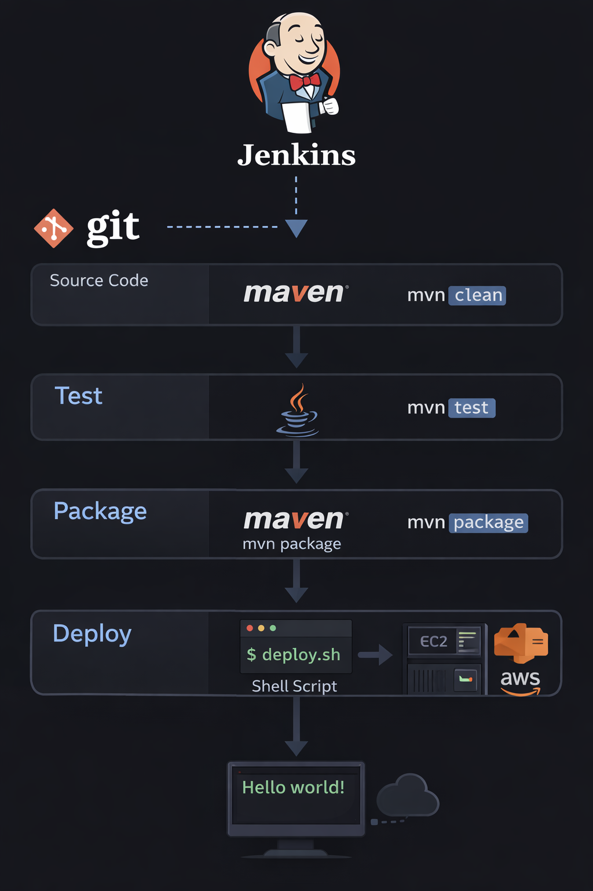
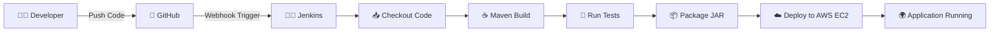

# 🚀 Java CI/CD Pipeline with Jenkins, Maven & AWS EC2


This repository is for the
[Build a Java app with Maven](https://jenkins.io/doc/tutorials/build-a-java-app-with-maven/)
tutorial in the [Jenkins User Documentation](https://jenkins.io/doc/).
------------------------------------------------------------------------



------------------------------------------------------------------------
## 🧩 Architecture Overview

    Developer → GitHub → Jenkins → Maven Build → JUnit Tests → Package JAR → Deploy to AWS EC2

------------------------------------------------------------------------

## 🛠 Tech Stack

  Category            Technology
  ------------------- --------------------------------
  📦 Source Control   Git + GitHub
  🔁 CI/CD Tool       Jenkins (Declarative Pipeline)
  ☕ Build Tool       Maven
  🧪 Testing          JUnit
  💻 Runtime          Java (Corretto 8 / 17)
  ☁️ Cloud            AWS EC2 (Amazon Linux 2023)
  📦 Artifact         Executable JAR

------------------------------------------------------------------------

# 🔄 End-to-End CI/CD Workflow

## 1️⃣ Code Push

-   Developer pushes code to GitHub
-   GitHub Webhook triggers Jenkins

## 2️⃣ Jenkins Pipeline Execution

-   Jenkins checks out source code
-   Runs on Jenkins agent

## 3️⃣ Build Stage

``` bash
mvn clean package
```

-   Compiles Java source
-   Runs JUnit tests
-   Generates JAR artifact

## 4️⃣ Archive Artifact

``` groovy
archiveArtifacts artifacts: '**/target/*.jar', fingerprint: true
```

## 5️⃣ Deploy Stage

-   Copies JAR to AWS EC2
-   Runs:

``` bash
java -jar my-app-1.0-SNAPSHOT.jar
```

------------------------------------------------------------------------

# 📊 Visual Pipeline Diagram



------------------------------------------------------------------------

# 📂 Project Structure

    simple-java-maven-app/
    │
    ├── src/main/java/
    │   └── App.java
    │
    ├── src/test/java/
    │   └── AppTest.java
    │
    ├── pom.xml
    └── Jenkinsfile

------------------------------------------------------------------------

# 🏆 What This Demonstrates

✅ Continuous Integration\
✅ Automated Testing\
✅ Artifact Management\
✅ Cloud Deployment\
✅ Real-world DevOps Workflow

------------------------------------------------------------------------

# 👨‍💻 Author

**Avik Banerjee**\
Cloud & DevOps Engineer\
AWS Certified \| Jenkins \| Docker \| CI/CD

------------------------------------------------------------------------

⭐ Built as part of hands-on CI/CD practice using Jenkins Declarative
Pipeline and Maven.
